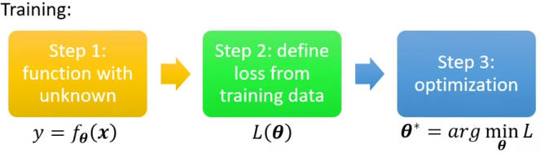
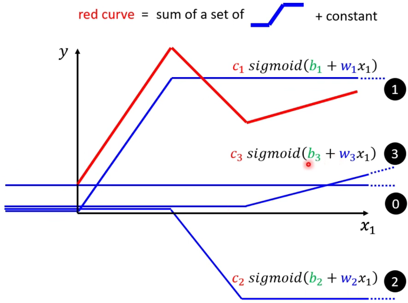
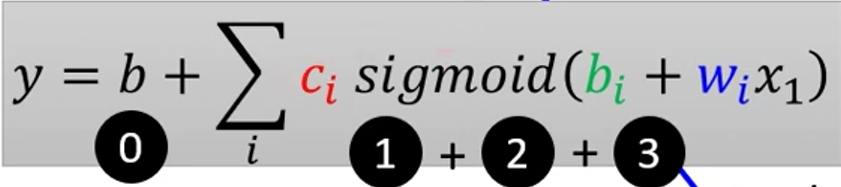
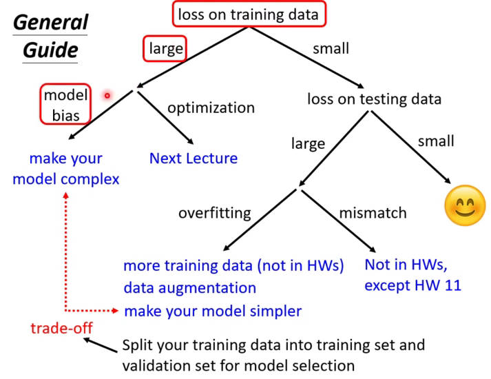
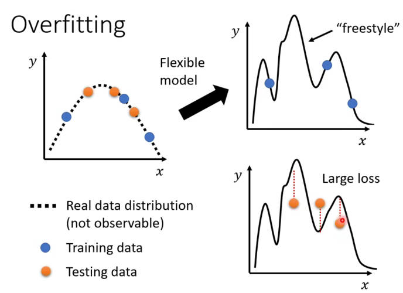
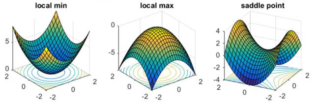

# ML

> 参照李宏毅机器学习课程笔记：[B站视频地址](https://www.bilibili.com/video/BV1Wv411h7kN/?spm_id_from=333.337.search-card.all.click&vd_source=412ee9f1892496b8506f8302ac9d1437)

**Lecture 1-5 监督学习，Supervised Learning**

**Lecture 6 生成对抗神经网络，Generative Adversarial Network**

**Lecture 7 无监督学习，Self - supervised Learning**

**Lecture 8 异常检测，Anomaly Detecion**

**Lecture 9 可解释性 AI，Explainable AI**

**Lecture 10 模型的攻击，Model Attack**

**Lecture 11 域适应，Domain Adaptation**

**Lecture 12 强化学习，Reinforcement Learning**

**Lecture 13 模型的压缩，Network Compression**

**Lecture 14 终身学习，Life-long Learning**

**Lecture 15 元学习(学习如何学习) Meta Learning**

## 0.前置

### 0.1 Kaggle

[kaggle](https://www.kaggle.com/)：和 ML 等机器学习相关的，需注册

## 1.机器学习基本概念

找到一个函式，实现相应的功能，如回归、分类、文本等，深度学习则是用深度神经网络来代替该函数式子。

找的函式不同，机器学习分为不同的类别。

- Regression
- Classification
- Structured Learning

**流程举例：**

训练，在已知数据上进行：

首先表示一个含有未知参数 $\theta$ 的函数，再定义一个 loss 函数，用于判断输入参数的好坏，找到一个参数 $\theta$ 使 loss 值最小。

1. （function with unknown）猜测的函式：$y= wx_1+b$
2. （define loss from training data）定义损失函数，判断是否猜测准确
3. （Optimization）优化 ，$w^*,b^*= \arg \underset{w,b}{\min}  L$，结束的情况达到局部最优或者预设的训练次数。

$$
y = b+\sum_i sigmoid(b_i+\sum_j w_{ij}x_j)
$$

其中的 $i$ 为样本呢数量，$j$ 为不同的 sigmoid 函数形式。最终的曲线（红线）可以看作各个值得线性组合。

损失函数会每个参数得导数，而后用初始值减去微分值与学习率得乘积。

Update 和 Epoch 得区别：

- 每个 batch 更新的参数
- 所有 batch 更新完一次

如 1000 个样本，Batch size  =10，则在 1 次 epoch 中进行了 1000/10 = 100 次得参数更新。根据 Batch size 大小的不同，1 个 epoch 过程中更新的参数数量也不同。

## 2.机器学习任务

### 2.1 机器学习训练的"攻略"

1. 检查 training data 的 loss，观察到 loss 值过大：

   1. 可能 model bias，model 的弹性不够。重新设计 model，使其更加复杂
   2. 可能 optimization issue，model 已经够大的，只是 optimization gradient descent 不给力。可以先找浅层的网络进行尝试，然后再进行  deeper network，观察并比较二者的 loss 值。

2. training data 的 loss 值足够小。观察 test data 的 loss：

   1. loss 值小：模型设计合适

   2. misbatch ，training data 和 test data 不一致性，来自不同的分布
   
   3. loss 值大：overfitting，除了训练数据点约束 (constrain) 模型外，其余地方模型可以灵活变换 (flexible)。

解决 overfitting 的措施：

- **Data augmentation**，根据对资料的理解，创造出数据。
- 给 model 较好的限制 (constrain)，减少参数或共用参数。

### 2.2 训练的困境-局部最小与鞍点

局部最值和鞍点的判断 (对于关键点 $g=0$ )：
$$
L(\theta) \approx L(\theta')+(\theta-\theta')^Tg+\frac{1}{2}(\theta-\theta')^TH(\theta-\theta')\\
L(\theta) \approx L(\theta')+\frac{1}{2}(\theta-\theta')^TH(\theta-\theta')\\
$$
local minima，局部最小值；saddle，鞍点。**具体看 Hessian 矩阵是否为正定矩阵或特征值的正负。**

- $H$ 为正定阵，局部最小
- $H$ 为负定阵，局部最大
- $H$ 特征值有大有小，鞍点

## Review

交叉验证：数据集的划分

